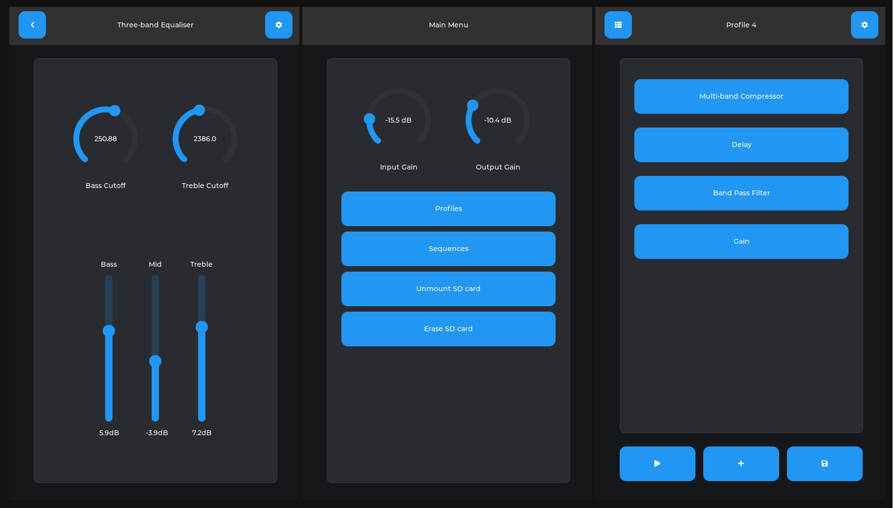

<p align="center">
  
</p>

# Kestrel Interface

This is the control system, graphical user interface and compiler for Kestrel. It uses FreeRTOS and LVGL and allows users to create, edit, manage, apply and sequence presets using effects from a local library of effects stored in text files on the local SD card. 

## Features

- Live, real-time smoothed parameter control
- Apply effects in any combination and any order
- Persistent state: resumes where left off on restart
- Preset management; create, save, edit and sequence presets
- Effects stored in plain text on SD card; new effects can easily be created and shared
- Symbolic math engine with range estimation for fixed-point format control
- High performance, lightweight UI: framerates over 100fps at 720p on ESP32-P4
- Input transmitted to FPGA in milliseconds

## Components

- Effect compiler
- FPGA core control engine
- Effect/preset/sequence engine
- Parameter control subsystem
- LVGL-based GUI framework
- Symbolic math engine
- File system

## Effect Descriptors

The Kestrel interface includes a parser and assembler for .eff files. These "effect descriptor" files are simple, small files containing metadata and descriptions of parameters and resource requirements as well as assembly code for the Kestrel core, in an intuitive syntax. For example, here is a biquad low-pass filter.

```
v1.0

.INFO

name: "Low Pass Filter"
cname: "example_low_pass_filter"

.PARAMETERS

cutoff: (name: "Cutoff",
         default: 1000,
         min: 60,
         max: sample_rate / 2 - 1,
         units: "Hz",
         scale = "logarithmic")
Q: (name: "Resonance", default: 1 / sqrt(2), min: 0.1, max: 3)

.DEFS

omega: 2 * pi * cutoff / sample_rate
alpha: sin(omega) / (2 * Q)

.RESOURCES

x1: (type: "mem")
x2: (type: "mem")
y1: (type: "mem")
y2: (type: "mem")

.CODE

mem_read c1 $x1
mem_read c2 $x2
mem_read c3 $y1
mem_read c4 $y2

macz [(1/2) * (1 - cos(omega)) / (1 + alpha)] c0
mac  [        (1 - cos(omega)) / (1 + alpha)] c1
mac  [(1/2) * (1 - cos(omega)) / (1 + alpha)] c2
mac  [        (2 * cos(omega)) / (1 + alpha)] c3
mac  [             (alpha - 1) / (1 + alpha)] c4

mem_write $x2 c1
mem_write $x1 c0
mem_write $y2 c3

mov_acc c0

mem_write $y1 c0
```

(Note: the filter engine allows for filters to be implemented more succinctly, and with better performance, this is just for demonstration).

All files in /sdcard/eff/ are read, parsed and assembled at startup, and used to populate the UI effect list. At runtime, effects are encoded on-the-fly using real-time parameter values and pipeline configurations and transmitted to the FPGA as programming commands over SPI.
Additionally, there are hooks for the UI framework in the .eff parser. For instance, the field "widget_type" can control whether a parameter is presented as a dial or a slider.

#### Features
- Simple assembly code with friendly syntax
- FPGA register values computed just-in-time from real-time
- Inline math expressions
- Delay buffers and scratchpad memory with simple assembly interface
- Variable, dependent parameter bounds
- Support for continuous parameters and discrete "settings"
- UI generated from file
- Definable parameter widget type and appearance

#### Planned features
- Include the instructions for accessing sin, tanh, etc look-up tables
- Add biquad and general IIR filter instructions
- Named expressions and custom function definition
- More UI control; widget size, placement


## Getting Started

### ESP32

The display subsystem uses the Waveshare board support package for ESP32-P4-nano (also works for ESP32-P4-pico) and the Waveshare touch-LCD-5A. Aside from the display driver, LVGL port, pin assignment, and driver for FPGA control, the rest of the system is largely platform independent. Additionally, 

To build for the ESP32-P4, simply run, in the repo root directory

```bash
# idf.py build
```
and, to flash,

```bash
# idf.py flash
```

### Desktop 

The repo includes an interface demo which will run on any POSIX system. To build this, run GNU Make

```bash
# make
```

in the repo root directory. To run it, run

```bash
# ./kest
```
There is an additional makefile target to compile the non-GUI/hardware components (preset library, .eff assembler) as a shared object library. To build the library,

```bash
# make lib
```
and to install the libkest.so to /usr/lib/ and the headers to /usr/include/libkest, run 

```bash
# make lib_install
```
as root. Then you can #include <libkest/kest_lib.h> and link with "-lkest" (if using ld)


## Repository Structure

The repo is structured as an ESP-IDF project currently. Future plans include supporting STM32 targets.

```
/docs           Documentation
/components
    /core       Core engine logic; handling presets, sequences, etc
    /parser     Parser for .eff files
    /fpga       Kestrel core driver/encoding
    /drivers    Other hardware drivers
    /ui         LVGL GUI code
/main           Headers and 'main.c' for ESP32
/desktop        Headers and 'main.c' for desktop demo
```

## Future Plans
- Support for STM32h743
- Better coverage for pre-allocation and memory pools
- Dependency trees for math expressions (for optimisation and cycle detection)
- Support for (not-yet-implemented) biquad and IIR filter modules on FPGA
- Various optimisations


## Contact

I'd love to hear from you! email: davidjfarrell96@gmail.com

## License

GNU GPL 3.0
