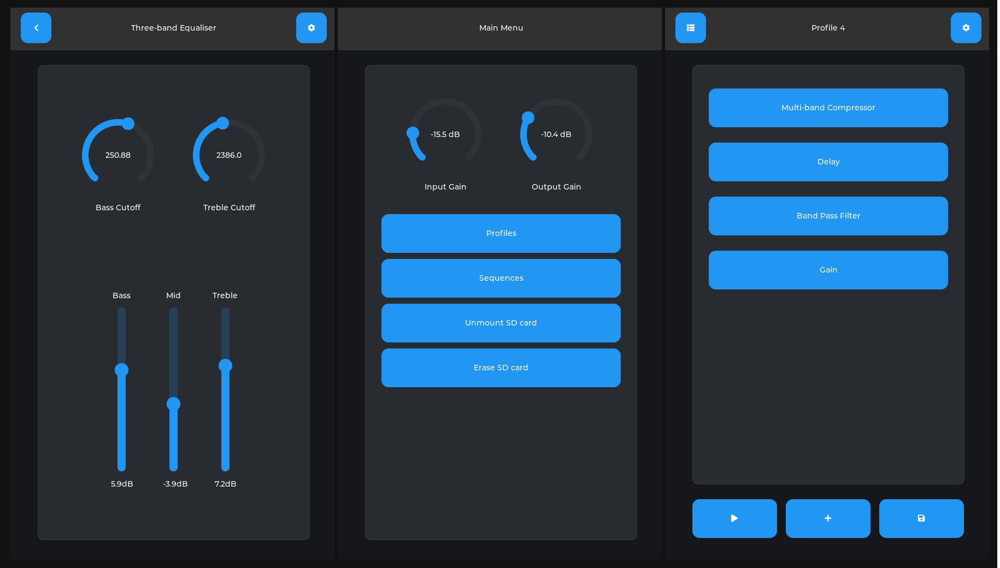

<p align="center">
  
</p>

# Kestrel Interface

This is the control system, graphical user interface and compiler for Kestrel. It uses FreeRTOS and LVGL and allows users to create, edit, manage, apply and sequence presets using effects from a local library of effects stored in text files on the local SD card. 

## Features

- Live, real-time smoothed parameter control
- Apply effects in any combination and any order
- Persistent state: resumes where left off on restart
- Preset management; create, save, edit and sequence presets
- Effects stored in plain text on SD card; new effects can easily be created and shared
- Symbolic math engine with range estimation for fixed-point format control
- High performance, lightweight UI: framerates over 100fps at 720p on ESP32-P4
- Input transmitted to FPGA in milliseconds

## Components

- Effect compiler
- FPGA core control engine
- Effect/preset/sequence engine
- Parameter control subsystem
- LVGL-based GUI framework
- Symbolic math engine
- File system

## Effect Descriptors

The Kestrel interface includes a parser and assembler for .eff files. These "effect descriptor" files are simple, small files containing metadata and descriptions of parameters and resource requirements as well as assembly code for the Kestrel core, in an intuitive syntax. For example, here is a biquad low-pass filter.

Optional `.INFO` discovery metadata is retained on descriptors: `description` is a string; `keywords`, `instruments`, `types`, and `genres` are string lists, such as `keywords: {"feedback", "rhythmic"}`. Existing descriptors need no changes. The search/filter UI remains planned.

A desktop discovery proposal reuses the current widgets for categories, keyboard
search, nested all/any/NOT filter groups and effect selection. From a superproject checkout, run
`python3 tools/discovery_preview.py --headless --output /tmp/new-discovery-preview`.
It uses a disposable library fixture and leaves carrier firmware unchanged.
Add `--script tools/ui_scripts/discovery_filters.txt` to capture the group editor.
Its title shows live draft match counts within the current search/category,
before Apply; Cancel preserves the applied filters.
Set `KEST_DISCOVERY_VIRTUAL_ROWS=1` and use
`tools/ui_scripts/discovery_virtual_rows.txt` to review bounded row recycling
through native scrolling and effect selection. Main category views also reuse
rows; exact duplicate tags are removed while case-distinct spellings remain.
Filter-value pickers use independent reusable rows and release their tag table
on Back, selection or dialog closure. Full descriptors and result/tag pointer
tables are still loaded; this is a desktop proposal.
`discovery_virtual_search.txt` and `discovery_virtual_filters.txt` check changing
results after scrolling, including selection, cancellation and clearing filters.
For row-clipping observation, set `KEST_DISCOVERY_TRACE_DRAW=1` and use
`tools/ui_scripts/discovery_draw_clip.txt`; this logs drawn rows and is unsuitable
for timing measurements.
Device integration and the production catalogue remain planned.

The isolated host metadata reader builds with
`make -f Makefile -f tools/info_reader_preview.mk bin/lib/info-reader-preview`.
Run `bin/lib/info-reader-preview FILE.eff ...` for the existing metadata records
without constructing effect graphs. It still tokenizes each complete file and
uses the global parser arena; executable code is not validated by this probe.

`tools/ui_scripts/discovery_search_refocus.txt` checks keyboard dismissal and
reopening by tapping search again, returning from Filters, and typing a query.

An isolated rounded-fill experiment builds with
`make -f Makefile -f tools/discovery_preview.mk bin/discovery-rounded-preview`.
Select that executable with `tools/desktop_ui.py --binary`; it splits rounded
fills into software edge strips and a software rectangular middle for pixel
comparison. It does not enable PPA or change firmware.
Build `bin/rounded-fill-check` with the same makefiles and run it to compare
20,256 seeded clipped/offset/radius/fallback fills with the original LVGL path
in RGB565 and XRGB8888.
The isolated `bin/rounded-corners-check` target tests an alternative RGB565
split into three flat rectangles and four software corners for widths of at
least 400 pixels, including after clipping. Smaller fills and XRGB8888 retain
the strip path because masked blending preserves its unused byte differently.
The rectangles are horizontal bands: the pinned PPA driver synchronizes full
picture-width rows, so this avoids repeatedly synchronizing overlapping rows.
This passes the same pixel oracle. Isolated carrier builds enable both
`KEST_ROUNDED_FILL_PREVIEW` and `KEST_ROUNDED_CORNERS_PREVIEW`; both default OFF.
Carrier comparison and physical acceptance are separate from the desktop oracle.
An additional OFF-by-default `KEST_ROUNDED_CACHE_PREVIEW` option requires both
rounded options and relies on the pinned IDF PPA driver's cache synchronization,
omitting the wrapper's extra flush/invalidate. This remains an isolated carrier
experiment; other SDK versions and physical performance require qualification.
Fresh isolated carrier builds also accept `rounded-fill-check reject`: alternate
PPA submissions fail before DMA while the UI lock holds the pixel oracle. It
checks software fallback alongside successful hardware fills. Reported errors
must equal `injected`; an ordinary check afterwards must return zero errors.
This does not inject partial DMA or timeouts, and the mode is cleared on return.
For carrier draw-path diagnosis, additionally enable `KEST_DRAW_PROFILE_PREVIEW`
in a separate IDF build with both rounded preview options. It defaults OFF and
requires those options. `ui-profile start/stop` then also reports call counts and
microseconds for software fill, border, label, arc, image and shadow paths.
The fill counter includes the experimental PPA interior. These instrumented
timings exclude unwrapped drawing and carry measurement overhead; they are not
an uninstrumented FPS comparison. Reporting occurs outside the UI lock.

```
v1.0

.INFO

name: "Low Pass Filter"
cname: "example_low_pass_filter"

.PARAMETERS

cutoff: (name: "Cutoff",
         default: 1000,
         min: 60,
         max: sample_rate / 2 - 1,
         units: "Hz",
         scale = "logarithmic")
Q: (name: "Resonance", default: 1 / sqrt(2), min: 0.1, max: 3)

.DEFS

omega: 2 * pi * cutoff / sample_rate
alpha: sin(omega) / (2 * Q)

.RESOURCES

x1: (type: "mem")
x2: (type: "mem")
y1: (type: "mem")
y2: (type: "mem")

.CODE

mem_read c1 $x1
mem_read c2 $x2
mem_read c3 $y1
mem_read c4 $y2

macz [(1/2) * (1 - cos(omega)) / (1 + alpha)] c0
mac  [        (1 - cos(omega)) / (1 + alpha)] c1
mac  [(1/2) * (1 - cos(omega)) / (1 + alpha)] c2
mac  [        (2 * cos(omega)) / (1 + alpha)] c3
mac  [             (alpha - 1) / (1 + alpha)] c4

mem_write $x2 c1
mem_write $x1 c0
mem_write $y2 c3

mov_acc c0

mem_write $y1 c0
```

(Note: the filter engine allows for filters to be implemented more succinctly, and with better performance, this is just for demonstration).

All files in /sdcard/eff/ are read, parsed and assembled at startup, and used to populate the UI effect list. At runtime, effects are encoded on-the-fly using real-time parameter values and pipeline configurations and transmitted to the FPGA as programming commands over SPI.
Additionally, there are hooks for the UI framework in the .eff parser. For instance, the field "widget_type" can control whether a parameter is presented as a dial or a slider.

#### Features
- Simple assembly code with friendly syntax
- FPGA register values computed just-in-time from real-time
- Inline math expressions
- Delay buffers and scratchpad memory with simple assembly interface
- Variable, dependent parameter bounds
- Support for continuous parameters and discrete "settings"
- UI generated from file
- Definable parameter widget type and appearance

#### Planned features
- Include the instructions for accessing sin, tanh, etc look-up tables
- Add biquad and general IIR filter instructions
- Named expressions and custom function definition
- More UI control; widget size, placement


## Getting Started

### ESP32

The current carrier firmware uses the Waveshare ESP32-P4-nano board support package, touch-LCD-5A and SGTL5000 audio codec. Its verified build baseline is **ESP-IDF v5.3.3**. The manifest pins the SDK and direct components; retain `dependencies.lock` to preserve transitive versions. The integrated Rev-B board requires a separate SDK, silicon-revision and driver migration.

Install the exact SDK release and its ESP32-P4 tools:

```bash
git clone --branch v5.3.3 --depth 1 --shallow-submodules --recursive https://github.com/espressif/esp-idf.git /path/to/esp-idf-v5.3.3
cd /path/to/esp-idf-v5.3.3
./install.sh esp32p4
```

Use Bash, source that checkout's environment, then build from this repository's root. CMake and Ninja must be available; if they are absent, install `cmake==3.30.9` and `ninja==1.11.1.4` into the SDK Python environment after exporting it.

```bash
source /path/to/esp-idf-v5.3.3/export.sh
idf.py --version  # ESP-IDF v5.3.3
cd /path/to/kestrel_interface
idf.py build
```

The application image is `build/kestrel-interface.bin`; a successful build does not verify device operation. To flash a connected carrier:

```bash
idf.py -p PORT flash
```

The firmware starts a UART0 diagnostic console at 115200 baud. Keep one connection
open during a test session; connection-state changes can reboot the carrier:

```bash
python3 tools/uart_console.py --port PORT --log /path/to/new-capture.log
```

Use `help`, `info`, `heap`, `pools`, `uptime` and `ui-tree` for inspection.
For redraw timing, run `ui-profile start`, perform the interaction, then
`ui-profile stop`. It reports rendered frames, flush count/pixels and accumulated
render, flush-call and flush-wait microseconds. Flush times are included in render
time; do not add them. Counters are opt-in and results print outside the UI lock.
Avoid `ui-tree` dumps during the measurement because they stall drawing.
`pools` reports capacity, free and used slots for each reserved typed pool.
`eff-info CNAME` reports the loaded descriptor's names and optional discovery
metadata. Text rows use `field=... index=N hex=...`; list headers include
`count=N`. A missing description has no text row; empty lists have count zero.
The command retains the immutable descriptor while printing outside the UI lock,
then releases it. `KEST eff-info result=0` marks completion; unknown cnames return
`ERR_NOT_FOUND`. This inspects loaded memory, not the SD file.

`eff-reload NAME.eff` reparses a published SD file and replaces the loaded descriptor
with the same `cname`, rebuilding every affected preset. It preserves effect IDs,
order and compatible named controls, refreshes UI bindings and reprograms the active
preset without rebooting or reinitializing the codec. DSP state restarts. Parse or
staging failure leaves the running model intact; incompatible bounds reject reload.
The reply is `KEST eff-reload result=0 affected=N` on acceptance; use `dsp`,
`fpga-status` and `pools` to inspect completion. New identities require startup discovery.
Each row is a locked snapshot; rows are sampled separately. `tap X Y` and
`touch down X Y`, `touch move X Y`, `touch up` feed a separate LVGL pointer through
normal UI input handling. `fpga-read ADDRESS` queues an asynchronous memory read.
`fpga-read32 ADDRESS` reads a word-aligned 24-bit byte address and prints four bytes
as a hexadecimal word. With the matching FPGA image, address 0 is `0x4b455354`
("KEST") and address 4 is the build mask: filter/polynomial/SVF in bits 0/1/2.
`fpga-status` reads and decodes the status byte through the SPI task.
`dsp` lists the active preset's effects, parameter IDs/current values/effective ranges
and driven/override flags, integer setting IDs/names/values/bounds/choice labels,
plus DSP resource addresses. Values can change between rows. Setting rows report
firmware state, not independently measured FPGA delay timing.
`parameter-target PRESET_ID EFFECT_ID PARAMETER_ID VALUE` queues a target through
the normal smoothing path. It rejects malformed/nonfinite/out-of-range values and
driven parameters without an override. A queued result is acceptance, not completion;
use `dsp` to observe convergence. Accepted edits mark the preset dirty.
`tools/hil_parameter_target.py --port PORT --log NEW_LOG PRESET EFFECT PARAMETER VALUE`
checks rejection/convergence and restores the captured value; it requires that effect
to be active and leaves accepted edits dirty.
The staged KTPOLY fixture can also use `tools/hil_scripts/carrier_polynomial_targets.json`
with `hil_interface.py` to check exact live FPGA scratchpad results and clean up the
temporary preset/file. Its seven-preset, temporary ID 8 and UI coordinates are fixture-specific.
With the current SD collection including TREMOLO and CHORUS, its probe label guard is
`(242, 964)` and selection taps `(360, 978)`; review after collection/layout changes.
`presets` lists the loaded preset collection. `sequences` snapshots the main
sequence and loaded sequences, their ordered preset IDs and current positions.
`sequence-step next` and `sequence-step prev` invoke normal navigation on the
active sequence and report the result and active preset ID. They do not start a
sequence; movement at either end is a no-op.
Sequence index 0 is the main sequence; indices are snapshot ordinals, not IDs.
`eff-file list`, `eff-file read NAME.eff`, `eff-file move OLD.eff NEW.eff` and
`eff-file delete NAME.eff` operate in the SD effect directory. Upload with
`eff-file write NAME.eff OFFSET HEX`: start at offset 0, then append consecutive
chunks (up to 128 decoded bytes each, within the 256-character command limit).
Wait for each command's result before sending the next chunk; rapid batches can
overrun the UART input buffer during SD writes. Verify the published bytes with
`eff-file read`.
Use 8.3 filenames (up to eight characters before `.eff`); extension matching is
case-insensitive. Writes go to `tmp/NAME.tmp` inside the effect directory; startup
skips that subdirectory. `eff-file publish NAME.eff` renames the completed
file into place. FAT refuses an existing destination; delete an old file explicitly
before replacing it. Reads return hex chunks. Commands require local SD ownership
and reject paths outside that directory. Existing loaded effects are unchanged;
live discovery/refresh remains planned. The host utility requires pyserial.

### Desktop 

The repo includes a POSIX desktop interface demo. Install SDL2 development tooling
(`libsdl2-dev` and `pkg-config` on Ubuntu), then build with GNU Make:

```bash
# make
```

in the repo root directory. To run it, run

```bash
# ./kest
```

For repeatable UI inspection using a temporary copy of `sdcard`:

```bash
python3 tools/desktop_ui.py --headless --script tools/ui_scripts/danger_button.txt --output /tmp/kestrel-ui-inspection
```

Choose a fresh output directory. The runner writes `control.log` and BMP screenshots,
plus PNG copies when Pillow is available. Omit `--headless` for a visible window.
Scripts accept `wait MS`, `click X Y`, `touch down X Y`, `touch move X Y`,
`touch up`, `tree`, `screenshot NAME.bmp` and `quit`;
the current desktop coordinates are 600×1024. `tree` reports visible LVGL objects,
labels and bounds so subsequent clicks can be chosen from the actual UI.
The sample opens the erase confirmation without confirming it. This exercises UI
code with simulated FPGA communications; it does not simulate DSP audio.

Run the C suite with `make tests && ./kest_tests`.
Run `make test-parser-allocation` for host-library scope, parameter and setting
failure/recovery checks, plus section/list rollback. It interposes the tracked allocator in the test executable;
firmware has no test hooks.

There is an additional makefile target to compile the non-GUI/hardware components (preset library, .eff assembler) as a shared object library. To build the library,

```bash
# make lib
```

To compile a single effect into a binary SPI programming body without installing
the library:

```bash
make compile-eff
bin/lib/compile_eff tests/fixtures/readback.eff /tmp/readback.bin
# Optional parameter overrides use the descriptor's internal names:
bin/lib/compile_eff ../effects/SVFHP.EFF /tmp/highpass.bin cutoff=2000 Q=0.7
# Configuration overrides use internal setting names and integral values:
bin/lib/compile_eff ../effects/experimental/RHYTHM.EFF /tmp/rhythm.bin setting.tempo=90 setting.division=24
# Default program plus a separate production parameter-update body:
bin/lib/compile_eff tests/fixtures/polynomial-live.eff /tmp/poly.bin --update /tmp/poly-update.bin shape=-0.25
# Inspect parser-retained discovery metadata without encoding a program:
bin/lib/compile_eff --info ../effects/BASSRING.EFF
```

The executable finds `libkest.so` beside itself. It uses the production parser,
effect constructor and pipeline encoder. The output includes the tail-enable
command but excludes the begin/end-program framing supplied by the transport.
Compilation alone does not verify DSP execution or audio results.
`--info` emits the same hex-text fields/counts as UART `eff-info`, using the
production parser without constructing an effect or writing a programming body.
Setting overrides require declared bounds and an existing enum choice. They are
available for complete programs; `--update` accepts parameter overrides only.

and to install the libkest.so to /usr/lib/ and the headers to /usr/include/libkest, run 

```bash
# make lib_install
```
as root. Then you can #include <libkest/kest_lib.h> and link with "-lkest" (if using ld)


## Repository Structure

The repo is structured as an ESP-IDF project currently. Future plans include supporting STM32 targets.

```
/docs           Documentation
/components
    /core       Core engine logic; handling presets, sequences, etc
    /parser     Parser for .eff files
    /fpga       Kestrel core driver/encoding
    /drivers    Other hardware drivers
    /ui         LVGL GUI code
/main           Headers and 'main.c' for ESP32
/desktop        Headers and 'main.c' for desktop demo
```

## Future Plans
- Support for STM32h743
- Better coverage for pre-allocation and memory pools
- Dependency trees for math expressions (for optimisation and cycle detection)
- Support for (not-yet-implemented) biquad and IIR filter modules on FPGA
- Various optimisations


## Contact

I'd love to hear from you! email: davidjfarrell96@gmail.com

## License

GNU GPL 3.0
